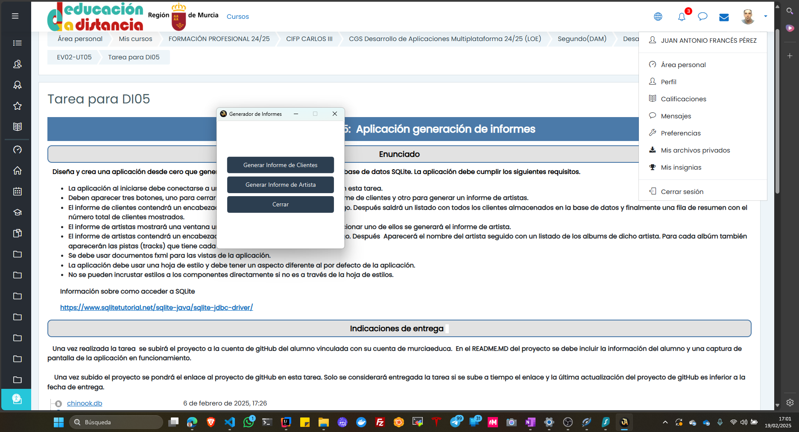
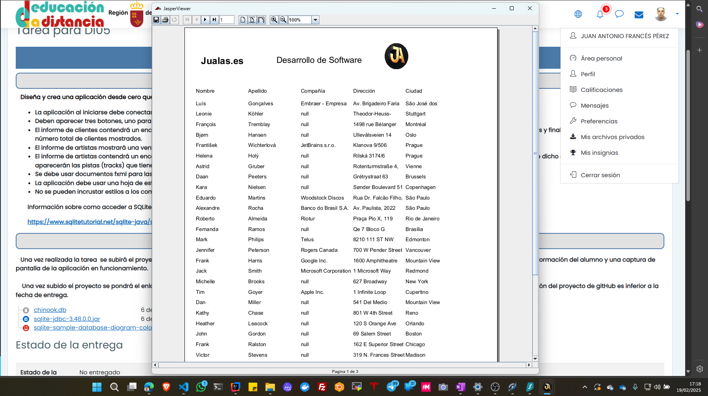
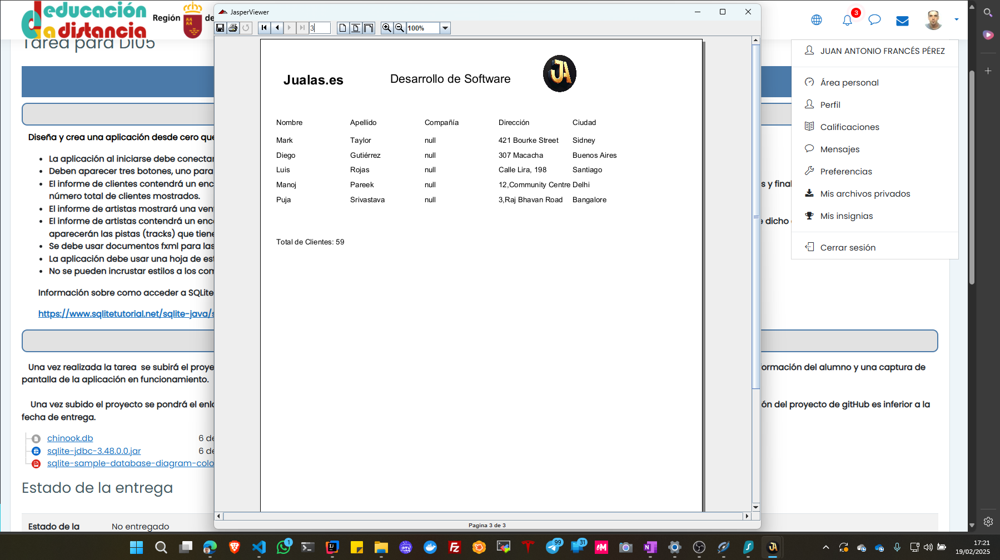
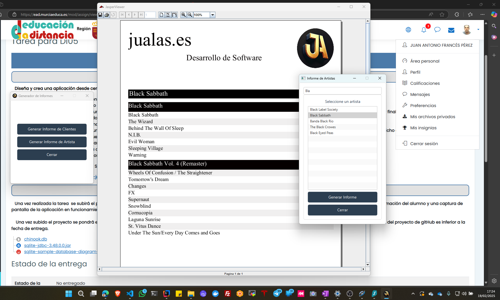

# Tarea_05
Tarea 05  Desarrollo de Interfaces 

## Características

- Generación de informes de clientes y artistas.
- Conexión a base de datos SQLite.
- Interfaz gráfica con JavaFX.
- Uso de JasperReports para la creación de informes.
- Búsqueda y filtrado de artistas.
- Visualización de informes en una nueva ventana.
- Manejo de errores con alertas en la interfaz.

## Requisitos
- **Java Development Kit (JDK) 21**: Asegúrate de tener instalado JDK 21.
- **Apache Maven**: Utilizado para la gestión de dependencias y la construcción del proyecto.
- **JavaFX**: Framework para la creación de interfaces gráficas.
- **SQLite**: Base de datos utilizada en el proyecto.
- **JasperReports**: Biblioteca para la generación de informes.
- **Log4j**: Biblioteca para el registro de logs.

## Dependencias

Las dependencias del proyecto están gestionadas en el archivo `pom.xml` y son las siguientes:

- `org.xerial:sqlite-jdbc:3.48.0.0`
- `org.openjfx:javafx-controls:21`
- `org.openjfx:javafx-fxml:21`
- `net.sf.jasperreports:jasperreports:6.20.6`
- `org.apache.logging.log4j:log4j-core:2.17.2`
- `org.apache.logging.log4j:log4j-api:2.17.2`

## Información del Alumno
- Nombre y Apellidos: Juan Antonio Francés Pérez
- NRA (Número regional de alumno): 3850437
- Correo de Alumno: 3850437@alu.murciaeduca.es
- Correo personal: jualas@jualas.es
- Página Personal: www.jualas.es
- Puedes ver los proyectos del curso en [mi perfil de GitHub](https://github.com/jualas).

## Capturas de Pantalla

